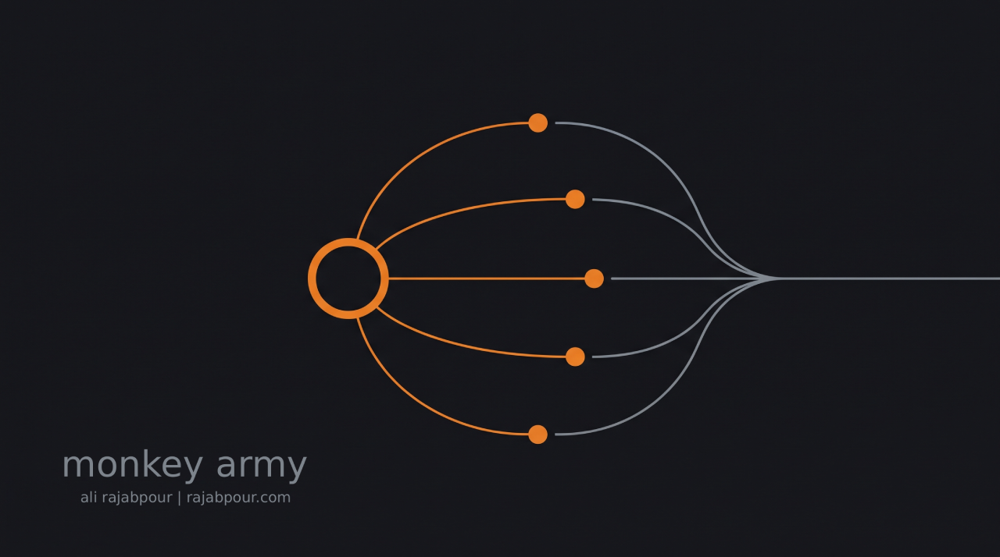

# Monkey Army

[](https://m8ven.ai/mcp/ali-rajabpour/monkeyarmy)

Opus commands, monkeys type, Opus signs off. A Claude Code plugin that delegates
micro-tasks from a frontier-model supervisor to cheap workers (DeepSeek & co. via
your local 9Router), isolated in disposable git worktrees, verified by the server,
and reviewed and merged back by the supervisor — never idle tokens spent on typing.

## What happens

1. **Assess** — the supervisor decides whether a task is even worth delegating.
2. **Decompose** — the task is broken into micro-specs, each touching ~1 file.
3. **Dispatch** — each spec goes to a cheap worker in its own git worktree.
4. **Verify** — the server re-runs tests/lint/build and checks scope and diff size.
5. **Review** — the supervisor reads every diff and approves or rejects it.
6. **Merge back** — approved work lands on your branch as a squash commit; the
   worktree and branch are cleaned up. No leftovers, ever.

## Install in 5 steps

1. Install `uv` (the only runtime the workers need).
2. Have 9Router running with a combo (DeepSeek + fallbacks) and an API key. In the 9Router
   dashboard, turn **RTK / Caveman tool-result compression OFF** for that key — workers read
   files through tool results, and compressing them corrupts what the worker sees.
3. Install the plugin once; it is then available in every conversation:
   ```bash
   claude plugin marketplace add ali-rajabpour/MonkeyArmy   # or a local path to this repo
   claude plugin install monkey-army@monkey-army
   ```
4. Run `/monkey-army:setup` (or say "monkeys: set up") — no restart, no env vars, no file editing;
   the key is entered in a secure dialog.
5. Try it on a scratch repo: `/monkey-army add a subtract(a, b) function to calc/__init__.py...`.

## Invoking it

Installed plugins load in every conversation, so you can reach for the monkeys at any point:

- `/monkey-army <task>` — start the delegation loop explicitly.
- "use monkey army for this task", "delegate this to the monkeys" — mid-conversation, in plain
  language; the supervisor loads the skill itself.
- "should we delegate this?" — the lighter `assess` skill answers DELEGATE / DO IT
  YOURSELF / BORDERLINE without dispatching anything.
- `/monkey-army:setup` — first-run configuration (URL, profile, key, combo, probe).
- `/monkey-army:status` — what is configured now, and is it healthy. Read-only.
- `/monkey-army:repair` — fix one thing: model, URL, prices, fallback, key, default, or drop a profile.
- `/monkey-army:reset` — delete every profile and stored key and start over (two-step; keeps your task
  history, patches and notes).

Commands are namespaced, so the full form is `/monkey-army:status` — type `/monkey` and the
menu will show them.

Full walkthrough: [`docs/SETUP.md`](docs/SETUP.md).

Got something wrong? `/monkey-army:setup` also fixes it: re-run it to overwrite a profile, or ask to
remove a profile, change the default, re-enter the key, or reset the configuration completely
(`configure(action="reset")`, two-step, keeps your task history).

If you launch Claude Code through a custom agent/persona with an explicit `tools:` list, add
`mcp__plugin_monkey-army_monkeys` to it — otherwise the server connects but its tools never
reach the session.

## Status line

An orange badge shows the active profile, and live worker counts while tasks run:

```
🐒 deepseek-combo ⏳2 ⚠1 $0.12
```

Nothing is shown until a profile is configured. Setup: [`docs/SETUP.md`](docs/SETUP.md#optional-status-line).

## What a run looks like (illustrative)

```
> /monkey-army add input validation to the signup form, with tests

Assessing... DELEGATE (mechanical, well-scoped).
Decomposed into 2 tasks: validate-email, validate-password.
Dispatched both. Waiting...
validate-email: succeeded, verification passed, scope ok, 34 lines.
Reviewed diff — approved. Integrated as one commit.
validate-password: succeeded, verification passed, scope ok, 41 lines.
Reviewed diff — approved. Integrated as one commit.
Batch finished: 1 worktree, 0 monkey/* branches left, full suite green.
Worker cost: $0.11 / 6,200 tokens. Compare with your /cost.
```

## Safety in one paragraph

Workers never touch your working tree: every write happens in a disposable git
worktree outside your repository, and a task only merges after the server
re-runs the acceptance command itself and the supervisor gives an explicit
approval — there is no path around either gate. Git is neutralised for workers
at the tool layer and by environment (no push, fetch, merge, rebase, or
credentials), and secrets are filtered out of worker shell commands. Be aware
that shell commands the worker runs inside its worktree are not sandboxed
beyond that — this is process isolation and gate enforcement, not a container.

## Docs

- [`docs/SETUP.md`](docs/SETUP.md) — install and configure
- [`docs/DESIGN.md`](docs/DESIGN.md) — architecture, invariants, security model
- [`docs/TOKEN-ECONOMICS.md`](docs/TOKEN-ECONOMICS.md) — why delegation saves tokens, and when it doesn't
- [`docs/VALIDATION.md`](docs/VALIDATION.md) — the validation checklist this plugin was tested against
- [`ROADMAP.md`](ROADMAP.md) — what's deliberately not built yet

## Author

**Ali Rajabpour Sanati** — [Rajabpour.com](https://Rajabpour.com)

- Contact: [ali@rajabpour.com](mailto:ali@rajabpour.com)
- Bugs and feature requests: [GitHub issues](https://github.com/ali-rajabpour/MonkeyArmy/issues)
- Security reports: [`SECURITY.md`](SECURITY.md) — by email, not a public issue.

## License

[AGPL-3.0-only](LICENSE). If you modify Monkey Army and make it available to others — including over a network — you must publish your version's full source under the same licence and keep the copyright notices. See [`NOTICE`](NOTICE).

Copyright © 2026 Ali Rajabpour Sanati.
